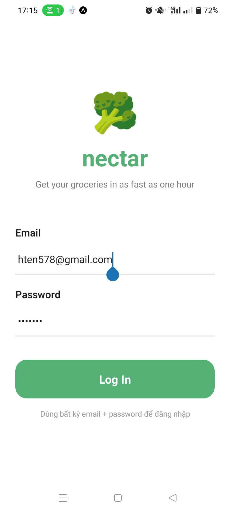
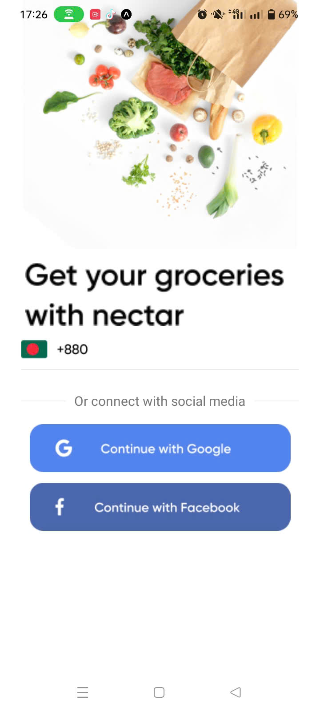
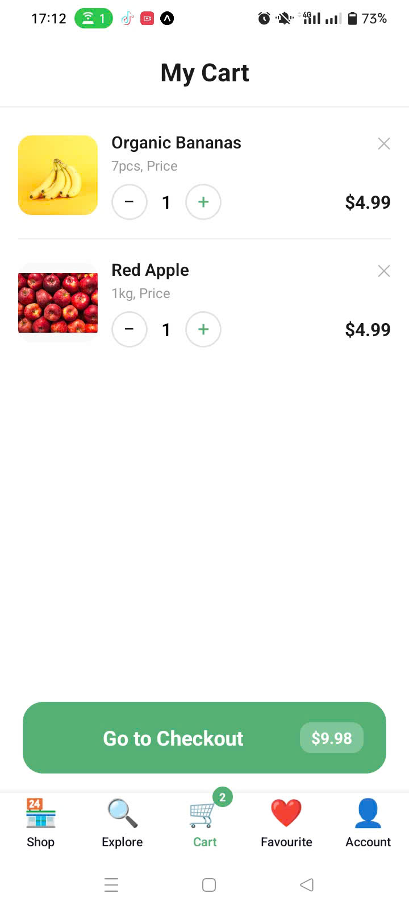
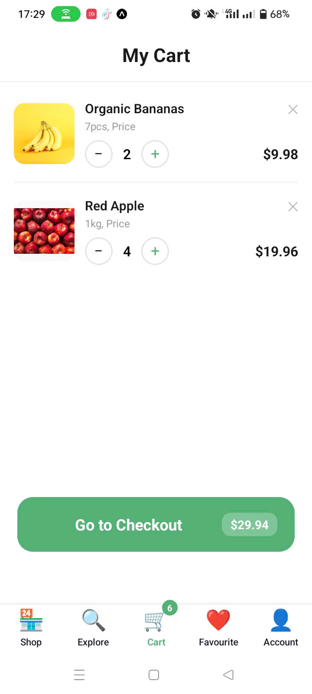
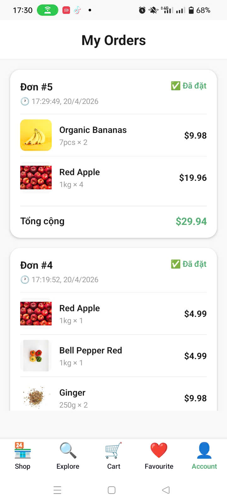

# 🥦 Nectar App - Ứng dụng mua sắm tạp hóa

## 👨‍🎓 Thông tin sinh viên
- **Họ tên**: Nguyễn Thị Huệ Minh
- **MSSV**: 23810310177
- **Lớp**: D18CNPM4

## 📱 Mô tả chức năng

Ứng dụng mua sắm tạp hóa trực tuyến với đầy đủ tính năng:

### ✅ Chức năng đã triển khai

#### 1. Xác thực & Đăng nhập (AsyncStorage)
- ✅ Đăng nhập với email/password
- ✅ Lưu thông tin user vào AsyncStorage
- ✅ **Auto-login**: Tự động đăng nhập khi mở lại app
- ✅ **Auto-expire**: Phiên đăng nhập tự động hết hạn sau 7 ngày
- ✅ Logout xóa toàn bộ dữ liệu

#### 2. Giỏ hàng (Cart Persistence)
- ✅ Thêm sản phẩm vào giỏ hàng
- ✅ **Lưu giỏ hàng vào AsyncStorage** (tự động lưu mỗi khi thay đổi)
- ✅ Tăng/giảm số lượng sản phẩm
- ✅ Xóa sản phẩm khỏi giỏ
- ✅ **Giỏ hàng vẫn còn sau khi tắt app**

#### 3. Đơn hàng (Orders)
- ✅ Checkout lưu đơn hàng vào AsyncStorage
- ✅ Hiển thị danh sách đơn hàng
- ✅ Mỗi đơn gồm: sản phẩm, tổng tiền, thời gian đặt
- ✅ **Đơn hàng vẫn còn sau khi reload app**

#### 4. Các màn hình khác
- ✅ Splash Screen
- ✅ Onboarding
- ✅ Sign In
- ✅ Phone Number
- ✅ Verification
- ✅ Select Location
- ✅ Home (danh sách sản phẩm)
- ✅ Explore (khám phá danh mục)
- ✅ Product Detail
- ✅ Favourite (yêu thích)
- ✅ Account (tài khoản)

## 🛠️ Công nghệ sử dụng

### Yêu cầu kỹ thuật (đã đáp ứng 100%)
- ✅ **@react-native-async-storage/async-storage** v2.2.0
- ✅ Tất cả hàm sử dụng **async/await**
- ✅ Tất cả hàm có **try/catch** xử lý lỗi
- ✅ Code tổ chức trong file riêng: `src/services/storageService.js`
- ✅ Dữ liệu lưu dưới dạng **JSON** (JSON.stringify / JSON.parse)

### Thư viện chính
```json
{
  "expo": "54.0.0",
  "react": "19.1.0",
  "react-native": "0.81.5",
  "@react-native-async-storage/async-storage": "2.2.0",
  "@react-navigation/native": "^7.2.2",
  "@react-navigation/bottom-tabs": "^7.15.9",
  "@react-navigation/native-stack": "^7.14.11"
}
```

## 📂 Cấu trúc thư mục

```
nectar-app/
├── src/
│   ├── services/
│   │   └── storageService.js      # AsyncStorage service (QUAN TRỌNG)
│   ├── context/
│   │   ├── AuthContext.js         # Quản lý authentication
│   │   └── CartContext.js         # Quản lý giỏ hàng
│   ├── screens/
│   │   ├── LoginScreen.js         # Màn hình đăng nhập
│   │   ├── CartScreen.js          # Màn hình giỏ hàng
│   │   ├── OrdersScreen.js        # Màn hình đơn hàng
│   │   ├── AccountScreen.js       # Màn hình tài khoản
│   │   ├── HomeScreen.js
│   │   ├── ExploreScreen.js
│   │   ├── ProductDetailScreen.js
│   │   └── ...
│   └── navigation/
│       └── AppNavigator.js        # Điều hướng app
├── assets/                        # Hình ảnh, icon
├── App.js                         # Entry point
├── package.json
└── README.md
```

## 🚀 Hướng dẫn chạy app

### Bước 1: Cài đặt dependencies

```bash
# Clone repository
git clone [URL_REPO_CỦA_BẠN]
cd nectar-app

# Cài đặt packages
npm install
```

### Bước 2: Khởi động app

```bash
# Khởi động Metro bundler
npx expo start

# Hoặc chạy trực tiếp trên Android
npx expo start --android

# Hoặc chạy trên iOS
npx expo start --ios
```

### Bước 3: Quét QR code

- Cài đặt **Expo Go** trên điện thoại
- Quét QR code từ terminal
- App sẽ tự động load

### ⚠️ Lưu ý khi gặp lỗi AsyncStorage

Nếu gặp lỗi: `"Native module is null, cannot access legacy storage"`

Chạy các lệnh sau:

```bash
# 1. Dừng Metro bundler (Ctrl+C)

# 2. Xóa cache
taskkill /F /IM node.exe
rmdir /s /q node_modules
del package-lock.json

# 3. Cài lại
npm install

# 4. Khởi động với cache sạch
npx expo start -c
```

## 📸 Demo ảnh

### 1. Login thành công


### 2. Auto-login sau khi tắt app


### 3. Logout quay về màn hình đăng nhập


### 4. Thêm sản phẩm vào giỏ


### 5. Giỏ hàng vẫn còn sau khi tắt app


### 6. Thay đổi số lượng


### 7. Checkout thành công


### 8. Danh sách đơn hàng


### 9. Đơn hàng vẫn còn sau khi reload



## 🎥 Video demo
(https://drive.google.com/file/d/1rbZtrXBh-Pn1q5AP5JICmyCbQzdLmkmo/view?usp=sharing)

## 📝 Tài liệu kỹ thuật

### AsyncStorage Service (`src/services/storageService.js`)

```javascript
// Lưu user
export const saveUser = async (user) => {
  try {
    const expiry = Date.now() + 7 * 24 * 60 * 60 * 1000; // 7 ngày
    await AsyncStorage.setItem(KEYS.USER, JSON.stringify(user));
    await AsyncStorage.setItem(KEYS.LOGIN_EXPIRY, JSON.stringify(expiry));
  } catch (e) {
    console.error('saveUser error:', e);
  }
};

// Lấy user (kiểm tra expiry)
export const getUser = async () => {
  try {
    const expiry = await AsyncStorage.getItem(KEYS.LOGIN_EXPIRY);
    if (expiry && Date.now() > JSON.parse(expiry)) {
      await clearUser();
      return null;
    }
    const data = await AsyncStorage.getItem(KEYS.USER);
    return data ? JSON.parse(data) : null;
  } catch (e) {
    console.error('getUser error:', e);
    return null;
  }
};
```

## 🎯 Điểm nổi bật

### Bonus Features đã triển khai:
- ✅ **Auto-expire login**: Phiên đăng nhập tự động hết hạn sau 7 ngày
- ✅ **Auto-save cart**: Giỏ hàng tự động lưu mỗi khi thay đổi
- ✅ **Loading states**: Hiển thị loading khi đang tải dữ liệu
- ✅ **Error handling**: Xử lý lỗi đầy đủ với try/catch

### Code Quality:
- ✅ Code sạch, dễ đọc, có comment
- ✅ Tổ chức file hợp lý (services, context, screens)
- ✅ Sử dụng Context API để quản lý state global
- ✅ UI/UX đẹp, mượt mà

## 📚 Tài liệu tham khảo

- [AsyncStorage Documentation](https://react-native-async-storage.github.io/async-storage/)
- [React Navigation](https://reactnavigation.org/)
- [Expo Documentation](https://docs.expo.dev/)


